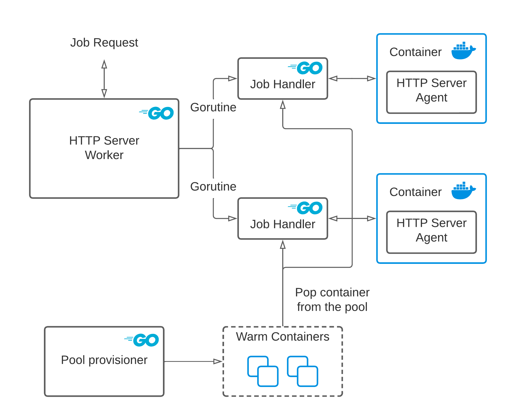

## worker 🍱

[](https://github.com/benhid/go-worker/actions/workflows/ci.yml)
[](https://goreportcard.com/report/github.com/benhid/go-worker)
[](LICENSE)

Run jobs using containerized functions. The worker keeps a pool of warm containers to reduce overhead, so new job are executed as they arrive.

Code execution is handled by the [agent](https://github.com/benhid/go-agent).



## Get started

### Build

```bash
go build -v
```

### Run

Start worker with:

```bash
./worker [-listen ":8090"] [-image "hello-python"] [-min-size 10]
```

### Usage

```bash
curl -X POST -H "Content-Type: application/json" \
  -d '{"ID": "1", "Payload": "hello world"}' \
  http://0.0.0.0:8090/run
```
